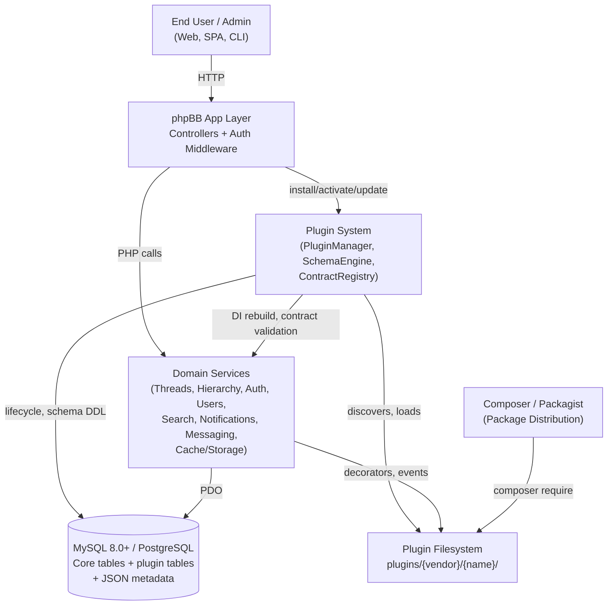
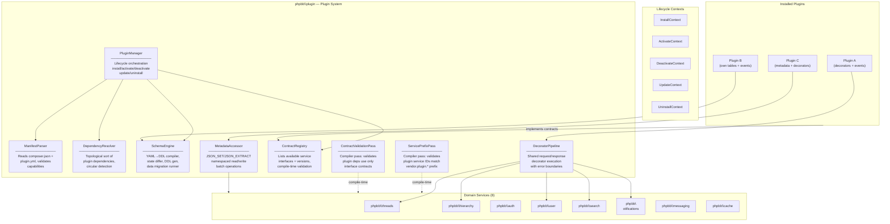
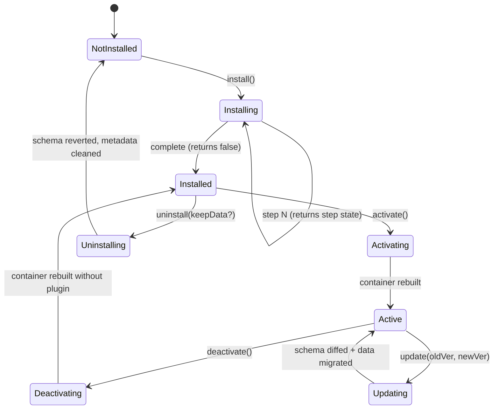
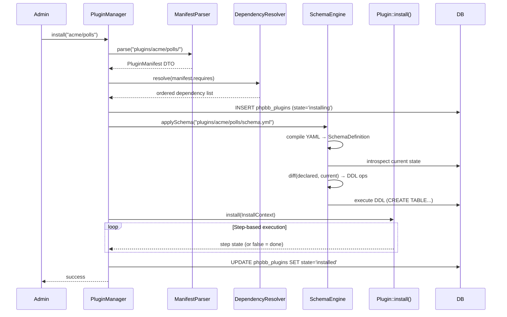
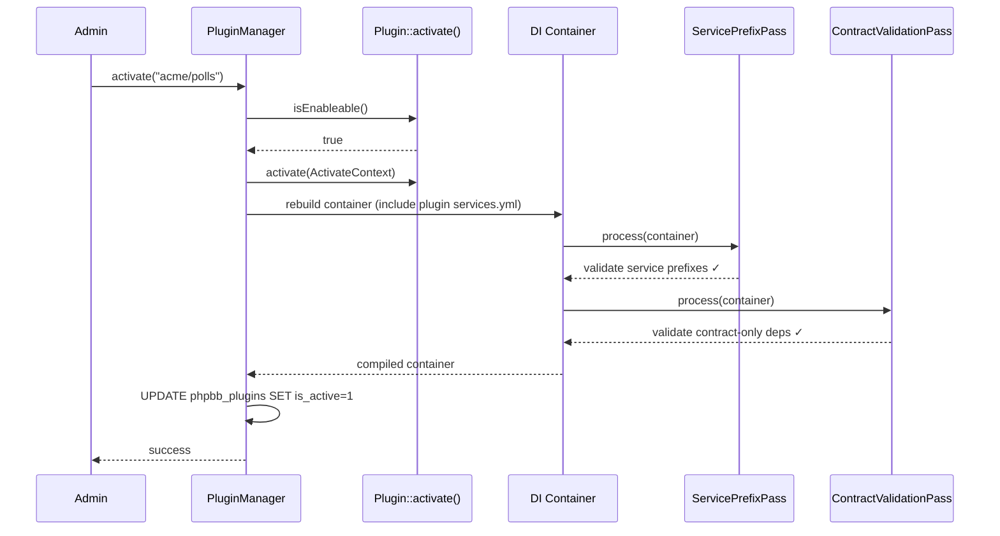
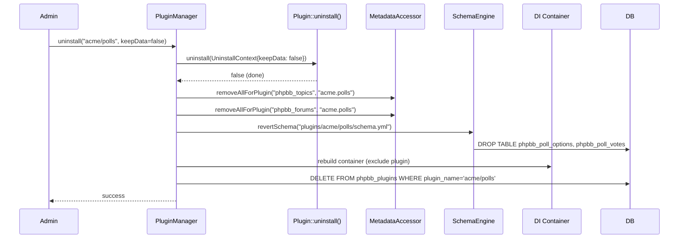
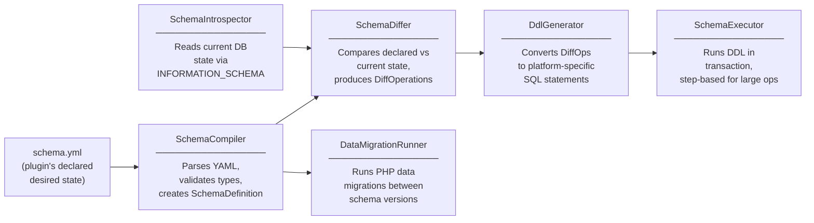

# High-Level Design: Unified Plugin System

## Design Overview

**Business context**: The phpBB rebuild comprises 8 domain services (Threads, Hierarchy, Auth, Users, Search, Notifications, Messaging, Cache/Storage), each using DecoratorPipeline, Symfony EventDispatcher, and JSON columns. Third-party extension is the primary driver of phpBB ecosystem value — historically 2,000+ extensions. No orchestration layer exists to manage plugin lifecycle, enforce isolation, or provide a consistent extension API across all services.

**Chosen approach**: A **unified plugin system** built on **Symfony DI**, with a **dual-file manifest** (`composer.json` + `plugin.yml`), **Shopware-inspired 5-stage lifecycle**, **shared decorator interfaces** with per-service pipelines and error boundaries, **JSON metadata columns** via `MetadataAccessor`, **declarative YAML→DDL schema management** for plugin-owned tables, and **interface-contract-only isolation** where plugins access core services exclusively through versioned public interfaces.

**Key decisions:**
- **Dual-file manifest** — `composer.json` for package identity/autoload, `plugin.yml` for phpBB capabilities; maximizes Composer ecosystem compatibility (DA-1)
- **5-stage lifecycle** — install/activate/deactivate/update/uninstall with step-based returns for resumable long migrations (DA-2)
- **Shared decorator interfaces** — `RequestDecoratorInterface`/`ResponseDecoratorInterface` in `phpbb\plugin\decorator\`, per-service pipelines, try/catch error boundaries (DA-3)
- **JSON metadata columns** — `metadata JSON` on forums/topics/users, `MetadataAccessor` with namespaced keys `vendor.plugin.key` (DA-4)
- **Declarative YAML→DDL schema** — plugins declare desired table state in `schema.yml`; system auto-diffs and generates DDL; complementary PHP data migrations for transforms (DA-5)
- **Interface-contract-only isolation** — every core service exposes a public interface; implementations are `@internal`; `PluginContractRegistry` documents available contracts (DA-6)

---

## Architecture

### System Context (C4 Level 1)



**External actors**:
- **End User / Admin** — triggers plugin install/activate via CLI or admin API; uses domain services extended by plugins
- **Composer / Packagist** — plugins distributed as Composer packages (`type: phpbb-plugin`)

### Container Overview (C4 Level 2)



---

## Key Components

| Component | Purpose | Key Interfaces / Classes | Dependencies | Configuration |
|-----------|---------|--------------------------|--------------|---------------|
| **PluginManager** | Orchestrates full plugin lifecycle (install→uninstall), state persistence, container rebuild | `phpbb\plugin\PluginManager` | ManifestParser, DependencyResolver, SchemaEngine, MetadataAccessor, DI Container, PDO | `phpbb_plugins` table |
| **ManifestParser** | Reads and validates dual-file manifest (composer.json + plugin.yml) | `phpbb\plugin\Manifest\ManifestParser`, `phpbb\plugin\Manifest\PluginManifest` (DTO) | Symfony YAML parser | Validates against JSON Schema |
| **DependencyResolver** | Topological sort of plugin install order, circular dependency detection | `phpbb\plugin\Dependency\DependencyResolver` | ManifestParser | — |
| **SchemaEngine** | Declarative YAML→DDL: parses schema.yml, diffs against DB state, generates + executes DDL | `phpbb\plugin\Schema\SchemaCompiler`, `phpbb\plugin\Schema\SchemaDiffer`, `phpbb\plugin\Schema\DdlGenerator`, `phpbb\plugin\Schema\DataMigrationRunner` | PDO, SchemaIntrospector | schema.yml per plugin |
| **MetadataAccessor** | Namespaced JSON read/write on core tables (forums, topics, users) | `phpbb\plugin\Metadata\MetadataAccessor` | PDO | — |
| **ContractRegistry** | Enumerates available service contracts + versions for plugin consumption | `phpbb\plugin\Contract\ContractRegistry`, `phpbb\plugin\Contract\ServiceContract` | Reads from compiled contract catalog | `contracts.yml` |
| **ContractValidationPass** | Compiler pass ensuring plugins only depend on contract interfaces, not `@internal` classes | `phpbb\plugin\DI\ContractValidationPass` | ContractRegistry, DI ContainerBuilder | — |
| **ServicePrefixPass** | Compiler pass ensuring plugin service IDs match `{vendor}.{plugin}.*` pattern | `phpbb\plugin\DI\ServicePrefixPass` | DI ContainerBuilder | — |
| **DecoratorPipeline** | Executes request/response decorators with priority ordering and error boundaries | `phpbb\plugin\Decorator\DecoratorPipeline` | Logger | Per-service DI tags |
| **AbstractPlugin** | Base class providing noop lifecycle methods; plugins extend this | `phpbb\plugin\AbstractPlugin` | — | — |

---

## Plugin Manifest Format

### `composer.json` — Package Identity

```json
{
    "name": "acme/polls",
    "type": "phpbb-plugin",
    "description": "Poll system for forum topics",
    "version": "1.0.0",
    "license": "GPL-2.0-only",
    "require": {
        "php": ">=8.2"
    },
    "extra": {
        "phpbb-plugin-class": "Acme\\Polls\\Plugin"
    },
    "autoload": {
        "psr-4": { "Acme\\Polls\\": "src/" }
    }
}
```

**Key fields**: `type: phpbb-plugin` is the discovery marker. `extra.phpbb-plugin-class` points to the lifecycle class. Version is canonical here (not duplicated in plugin.yml).

### `plugin.yml` — phpBB Capabilities

```yaml
name: acme/polls
label: "Topic Polls"
min_phpbb_version: "4.0.0"

requires:
    # Plugin-to-plugin dependencies (optional)
    # acme/base: "^1.0"

capabilities:
    decorators:
        - { service: threads, type: request }
        - { service: threads, type: response }
    events:
        - phpbb\threads\event\TopicCreatedEvent
        - phpbb\threads\event\TopicDeletedEvent
    metadata:
        - { table: phpbb_topics, keys: ["acme.polls.has_poll", "acme.polls.end_time"] }

schema: schema.yml    # path to declarative schema (relative to plugin root)

uninstall:
    keep_data: false   # default; admin can override at uninstall time
```

**Design note**: The `capabilities` section is **declarative metadata** — it powers admin UI display, dependency validation, and cleanup orchestration. Registration itself happens via DI tags (compiled into the container). The `schema` field points to the declarative YAML schema file.

---

## Plugin Lifecycle

### State Machine



### Lifecycle Base Class

```php
namespace phpbb\plugin;

abstract class AbstractPlugin
{
    /**
     * Called once when plugin is first installed.
     * Return false when done, or a step-state value for resumable execution.
     */
    public function install(InstallContext $context): bool|string { return false; }

    /**
     * Called when plugin is enabled. Container will be rebuilt after.
     */
    public function activate(ActivateContext $context): bool|string { return false; }

    /**
     * Called when plugin is disabled. Container will be rebuilt after.
     */
    public function deactivate(DeactivateContext $context): bool|string { return false; }

    /**
     * Called when plugin version changes. Schema auto-diffed before this.
     */
    public function update(UpdateContext $context): bool|string { return false; }

    /**
     * Called on plugin removal. Schema tables dropped unless keepData=true.
     */
    public function uninstall(UninstallContext $context): bool|string { return false; }

    /**
     * Pre-activation check. Return true or array of error messages.
     */
    public function isEnableable(): true|array { return true; }
}
```

### Install Sequence



### Activate Sequence



### Uninstall Sequence



---

## Decorator Integration

### Shared Interfaces

```php
namespace phpbb\plugin\decorator;

interface RequestDecoratorInterface
{
    /** Return true if this decorator should process the given request DTO. */
    public function supports(object $request): bool;

    /** Transform request DTO. Must return same type. */
    public function decorateRequest(object $request): object;

    /** Lower number = earlier execution. Default 0. */
    public function getPriority(): int;
}

interface ResponseDecoratorInterface
{
    /** Return true if this decorator should process the given response DTO. */
    public function supports(object $response): bool;

    /** Enrich response DTO. Receives original request for context. */
    public function decorateResponse(object $response, object $request): object;

    /** Lower number = earlier execution. Default 0. */
    public function getPriority(): int;
}
```

### DecoratorPipeline with Error Boundary

```php
namespace phpbb\plugin\decorator;

final class DecoratorPipeline
{
    /** @param iterable<RequestDecoratorInterface> $requestDecorators */
    /** @param iterable<ResponseDecoratorInterface> $responseDecorators */
    public function __construct(
        private readonly iterable $requestDecorators,
        private readonly iterable $responseDecorators,
        private readonly \Psr\Log\LoggerInterface $logger,
    ) {}

    public function decorateRequest(object $request): object
    {
        foreach ($this->requestDecorators as $decorator) {
            if ($decorator->supports($request)) {
                try {
                    $request = $decorator->decorateRequest($request);
                } catch (\Throwable $e) {
                    $this->logger->error('Request decorator failed', [
                        'decorator' => $decorator::class,
                        'request'   => $request::class,
                        'error'     => $e->getMessage(),
                    ]);
                    // Continue pipeline — one broken decorator must not block the request
                }
            }
        }
        return $request;
    }

    public function decorateResponse(object $response, object $request): object
    {
        foreach ($this->responseDecorators as $decorator) {
            if ($decorator->supports($response)) {
                try {
                    $response = $decorator->decorateResponse($response, $request);
                } catch (\Throwable $e) {
                    $this->logger->error('Response decorator failed', [
                        'decorator' => $decorator::class,
                        'response'  => $response::class,
                        'error'     => $e->getMessage(),
                    ]);
                }
            }
        }
        return $response;
    }
}
```

### Registration via DI Tags

Each service has its own pair of DI tags. Plugin decorators register per-service:

```yaml
# plugins/acme/polls/config/services.yml
services:
    acme.polls.request_decorator:
        class: Acme\Polls\Decorator\PollRequestDecorator
        arguments: ['@phpbb.threads']   # uses contract interface
        tags:
            - { name: phpbb.threads.request_decorator, priority: 100 }

    acme.polls.response_decorator:
        class: Acme\Polls\Decorator\PollResponseDecorator
        arguments: ['@acme.polls.repository']
        tags:
            - { name: phpbb.threads.response_decorator, priority: 100 }
```

### Per-Service Tag Catalog

| Service | Request Decorator Tag | Response Decorator Tag | Notable DTOs |
|---------|----------------------|----------------------|--------------|
| **Threads** | `phpbb.threads.request_decorator` | `phpbb.threads.response_decorator` | `CreateTopicRequest`, `TopicViewResponse` |
| **Hierarchy** | `phpbb.hierarchy.request_decorator` | `phpbb.hierarchy.response_decorator` | `CreateForumRequest`, `ForumTreeResponse` |
| **Users** | `phpbb.user.request_decorator` | `phpbb.user.response_decorator` | `RegisterUserRequest`, `UserProfileResponse` |
| **Search** | `phpbb.search.request_decorator` | `phpbb.search.response_decorator` | `SearchRequest`, `SearchResultResponse` |
| **Notifications** | `phpbb.notifications.request_decorator` | `phpbb.notifications.response_decorator` | `CreateNotificationRequest`, `NotificationListResponse` |
| **Messaging** | `phpbb.messaging.request_decorator` | `phpbb.messaging.response_decorator` | `SendMessageRequest`, `ConversationResponse` |
| **Auth** | — (no decorator pipeline) | — | Uses events only: `LoginEvent`, `LogoutEvent` |
| **Cache/Storage** | — (infrastructure, no decorator pipeline) | — | Events only: `CacheInvalidatedEvent`, `FileStoredEvent` |

**Note**: Auth and Cache/Storage are infrastructure services. Plugins extend them via events, not decorators. Search also supports mutable `PreSearchEvent`/`PostSearchEvent` as a decorator-equivalent mechanism.

---

## Metadata System

### Core Table Additions

Core migration adds `metadata JSON DEFAULT NULL` to:
- `phpbb_forums` — per-forum plugin settings (e.g., "polls enabled in this forum")
- `phpbb_topics` — per-topic plugin flags (e.g., "topic has poll", "poll end time")
- `phpbb_users` — already has `profile_fields` and `preferences` JSON; a `metadata` column is added for plugin-specific data

NOT added to `phpbb_posts` (respects Threads ADR-001: "raw text only").

### MetadataAccessor API

```php
namespace phpbb\plugin\metadata;

final class MetadataAccessor
{
    public function __construct(
        private readonly \PDO $db,
        private readonly string $tablePrefix,
    ) {}

    /**
     * Read a namespaced key from a record's metadata JSON column.
     *
     * @param string $table  Table name without prefix (e.g., 'topics')
     * @param int    $recordId  Primary key value
     * @param string $key    Namespaced key: "vendor.plugin.keyname"
     * @param mixed  $default  Returned if key doesn't exist
     */
    public function get(string $table, int $recordId, string $key, mixed $default = null): mixed
    {
        // SELECT JSON_EXTRACT(metadata, :path) FROM {table} WHERE {pk} = :id
    }

    /**
     * Write a namespaced key. Uses JSON_SET for atomic partial update.
     */
    public function set(string $table, int $recordId, string $key, mixed $value): void
    {
        // UPDATE {table} SET metadata = JSON_SET(COALESCE(metadata, '{}'), :path, :value)
        //   WHERE {pk} = :id
    }

    /**
     * Batch read a key across multiple records (avoids N+1).
     *
     * @return array<int, mixed>  recordId => value
     */
    public function getBatch(string $table, array $recordIds, string $key): array
    {
        // SELECT {pk}, JSON_EXTRACT(metadata, :path) FROM {table} WHERE {pk} IN (:ids)
    }

    /**
     * Remove all keys for a plugin prefix from a table. Used during uninstall.
     *
     * @param string $pluginPrefix  e.g., "acme.polls"
     */
    public function removeAllForPlugin(string $table, string $pluginPrefix): void
    {
        // UPDATE {table} SET metadata = JSON_REMOVE(metadata, :path)
        //   WHERE JSON_CONTAINS_PATH(metadata, 'one', :path)
    }
}
```

### Key Naming Convention

Format: `{vendor}.{plugin}.{key}` — e.g., `acme.polls.has_poll`, `acme.polls.end_time`.

- Vendor and plugin segments derived from `composer.json` `name` field
- Enforced by ManifestParser at install time (validates `plugin.yml` `capabilities.metadata` keys match plugin prefix)
- Prevents cross-plugin collisions

### Performance Strategy

- **Primary use case** (fast): Read metadata alongside parent record — `SELECT *, JSON_EXTRACT(metadata, '$.acme.polls.has_poll') FROM phpbb_topics WHERE topic_id = ?`
- **Hot-path queries** (deferred optimization): Plugins needing `WHERE metadata.key = value` can declare indexed keys in `schema.yml` — the SchemaEngine generates MySQL virtual columns + indexes:

```yaml
# schema.yml — indexed metadata (future enhancement)
metadata_indexes:
    phpbb_topics:
        acme_polls_has_poll:
            path: "$.acme.polls.has_poll"
            type: bool
```

Generates:
```sql
ALTER TABLE phpbb_topics
    ADD COLUMN _meta_acme_polls_has_poll BOOL
    GENERATED ALWAYS AS (JSON_EXTRACT(metadata, '$.acme.polls.has_poll')) VIRTUAL;
CREATE INDEX idx_topics_acme_polls ON phpbb_topics(_meta_acme_polls_has_poll);
```

This is a progressive enhancement — not required at MVP.

---

## Schema System (Declarative YAML→DDL)

This is the highest-investment component of the plugin system. Plugins declare their desired table state in `schema.yml`; the SchemaEngine compares this to the current database state and generates DDL automatically. A complementary PHP data migration mechanism handles transforms that DDL cannot express.

### schema.yml Format

```yaml
# plugins/acme/polls/schema.yml
tables:
    poll_options:                          # table name (prefixed automatically: phpbb_poll_options)
        columns:
            option_id:
                type: uint                # uint, int, varchar, text, bool, decimal, datetime
                auto_increment: true
            topic_id:
                type: uint
                nullable: false
                default: 0
            option_text:
                type: varchar
                length: 255
                default: ""
            vote_count:
                type: uint
                default: 0
            created_at:
                type: uint                # unix timestamp
                default: 0
        primary_key: [option_id]
        indexes:
            idx_topic: [topic_id]
            idx_topic_votes: [topic_id, vote_count]
        unique_keys:
            # uq_example: [topic_id, option_text]

    poll_votes:
        columns:
            vote_id:
                type: uint
                auto_increment: true
            topic_id:
                type: uint
            user_id:
                type: uint
            option_id:
                type: uint
            voted_at:
                type: uint
                default: 0
        primary_key: [vote_id]
        indexes:
            idx_topic_user: [topic_id, user_id]
            idx_option: [option_id]
```

### Supported Column Types

| YAML Type | MySQL Mapping | PostgreSQL Mapping |
|-----------|---------------|-------------------|
| `uint` | `INT UNSIGNED` | `INTEGER CHECK (col >= 0)` |
| `int` | `INT` | `INTEGER` |
| `bigint` | `BIGINT` | `BIGINT` |
| `bool` | `TINYINT(1)` | `BOOLEAN` |
| `varchar` | `VARCHAR(length)` | `VARCHAR(length)` |
| `text` | `MEDIUMTEXT` | `TEXT` |
| `decimal` | `DECIMAL(precision, scale)` | `DECIMAL(precision, scale)` |
| `datetime` | `INT` (unix timestamp) | `INTEGER` |
| `json` | `JSON` | `JSONB` |

### SchemaEngine Architecture



### Core Components

#### SchemaCompiler

```php
namespace phpbb\plugin\schema;

final class SchemaCompiler
{
    /**
     * Parse schema.yml into a SchemaDefinition object.
     * Validates column types, checks for reserved table names,
     * ensures primary keys reference existing columns.
     *
     * @throws SchemaValidationException on invalid YAML
     */
    public function compile(string $yamlPath, string $pluginName): SchemaDefinition;
}

final readonly class SchemaDefinition
{
    /** @param array<string, TableDefinition> $tables */
    public function __construct(
        public string $pluginName,
        public array $tables,
    ) {}
}

final readonly class TableDefinition
{
    /** @param array<string, ColumnDefinition> $columns */
    public function __construct(
        public string $name,
        public array $columns,
        public array $primaryKey,
        public array $indexes = [],
        public array $uniqueKeys = [],
    ) {}
}

final readonly class ColumnDefinition
{
    public function __construct(
        public string $name,
        public string $type,
        public ?int $length = null,
        public bool $nullable = false,
        public mixed $default = null,
        public bool $autoIncrement = false,
    ) {}
}
```

#### SchemaIntrospector

```php
namespace phpbb\plugin\schema;

final class SchemaIntrospector
{
    public function __construct(
        private readonly \PDO $db,
        private readonly string $tablePrefix,
    ) {}

    /**
     * Read current state of a table from INFORMATION_SCHEMA.
     * Returns null if table doesn't exist.
     */
    public function introspect(string $tableName): ?TableDefinition;

    /**
     * Check if a table exists in the current database.
     */
    public function tableExists(string $tableName): bool;
}
```

#### SchemaDiffer

```php
namespace phpbb\plugin\schema;

final class SchemaDiffer
{
    /**
     * Compare declared schema (from YAML) against current DB state.
     * Returns ordered list of operations needed to bring DB to declared state.
     */
    public function diff(SchemaDefinition $declared, SchemaIntrospector $introspector): array;
}
```

The differ produces typed operation objects:

```php
namespace phpbb\plugin\schema\operation;

interface DiffOperation {}

final readonly class CreateTable implements DiffOperation
{
    public function __construct(public TableDefinition $table) {}
}

final readonly class DropTable implements DiffOperation
{
    public function __construct(public string $tableName) {}
}

final readonly class AddColumn implements DiffOperation
{
    public function __construct(
        public string $tableName,
        public ColumnDefinition $column,
        public ?string $afterColumn = null,
    ) {}
}

final readonly class DropColumn implements DiffOperation
{
    public function __construct(public string $tableName, public string $columnName) {}
}

final readonly class ModifyColumn implements DiffOperation
{
    public function __construct(
        public string $tableName,
        public ColumnDefinition $oldColumn,
        public ColumnDefinition $newColumn,
    ) {}
}

final readonly class AddIndex implements DiffOperation
{
    public function __construct(
        public string $tableName,
        public string $indexName,
        public array $columns,
        public bool $unique = false,
    ) {}
}

final readonly class DropIndex implements DiffOperation
{
    public function __construct(public string $tableName, public string $indexName) {}
}
```

**Diff rules**:
1. Table in YAML but not in DB → `CreateTable`
2. Table in DB but not in YAML (on uninstall) → `DropTable`
3. Column in YAML but not in DB table → `AddColumn`
4. Column in DB but dropped from YAML → `DropColumn` (with confirmation — destructive)
5. Column type/length/default changed → `ModifyColumn`
6. Index differences → `AddIndex` / `DropIndex`

**Safety: destructive operations require explicit confirmation**. The `SchemaDiffer` flags `DropColumn` and `DropTable` as destructive. The `PluginManager` must confirm these with the admin before executing. On a fresh install, only `CreateTable` operations are generated.

#### DdlGenerator

```php
namespace phpbb\plugin\schema;

interface DdlGeneratorInterface
{
    /** @return string[] SQL statements */
    public function generate(DiffOperation $operation): array;
}

final class MysqlDdlGenerator implements DdlGeneratorInterface { ... }
final class PostgresDdlGenerator implements DdlGeneratorInterface { ... }
```

Platform-specific SQL generation. The correct generator is selected based on the PDO driver.

#### SchemaExecutor

```php
namespace phpbb\plugin\schema;

final class SchemaExecutor
{
    public function __construct(
        private readonly \PDO $db,
        private readonly DdlGeneratorInterface $ddlGenerator,
        private readonly \Psr\Log\LoggerInterface $logger,
    ) {}

    /**
     * Execute diff operations. Wraps each operation in a transaction.
     * Returns false when all done, or a step state for resumable execution.
     */
    public function execute(array $operations, ?string $stepState = null): bool|string;
}
```

### Data Migrations (Complementary to Schema)

Declarative YAML solves schema (tables, columns, indexes) but cannot express data transformations: backfilling computed columns, renaming values, seeding lookup tables. For these, plugins provide PHP data migration classes:

```php
namespace Acme\Polls\DataMigration;

use phpbb\plugin\schema\DataMigrationInterface;

final class SeedDefaultPollOptions implements DataMigrationInterface
{
    /**
     * Version at which this data migration runs.
     * Executed AFTER schema is applied for this version.
     */
    public function getVersion(): string { return '1.0.0'; }

    public function up(\PDO $db, string $tablePrefix): void
    {
        // INSERT default poll configuration...
    }

    public function down(\PDO $db, string $tablePrefix): void
    {
        // DELETE seeded data...
    }
}
```

**Discovery**: Data migration classes are auto-discovered from `src/DataMigration/` directory, ordered by version (semver sort), and tracked in `phpbb_plugins.state` JSON column.

### Schema Lifecycle Integration

| Lifecycle Event | Schema Action |
|----------------|---------------|
| **install()** | Compile + diff + execute DDL (CreateTable only, since tables don't exist yet). Then run data migrations for current version. |
| **update(old, new)** | Re-compile with new schema.yml. Diff against current DB state. Generate DDL for changes. Execute DDL. Run data migrations for versions between old and new. |
| **uninstall(keepData=false)** | Generate DropTable for all declared tables. Execute DDL. |
| **uninstall(keepData=true)** | Skip schema revert. Tables remain. |

### Schema Versioning

The current schema state is tracked via the `plugin_version` column in `phpbb_plugins`. On update:
1. Load old `schema.yml` (stored as snapshot in `phpbb_plugins.state` JSON on install/update)
2. Load new `schema.yml` from updated plugin files
3. Diff old → new = incremental DDL operations
4. Execute DDL
5. Run data migrations for versions between old and new
6. Store new schema snapshot in `phpbb_plugins.state`

Storing a schema snapshot ensures that even if the plugin's `schema.yml` is updated on disk before the update process runs, the differ can produce an accurate diff.

---

## Plugin Contracts (Interface Isolation)

### Design Principle

Every core service that plugins can access exposes a **public interface** (contract). The implementation class is `@internal`. The DI container registers alias from interface to implementation. Plugins depend on the interface, never the implementation.

```php
// Public contract — stable API surface
namespace phpbb\threads;

interface ThreadsServiceInterface
{
    public function createTopic(CreateTopicRequest $request): TopicCreatedEvent;
    public function editPost(EditPostRequest $request): PostEditedEvent;
    public function getTopic(int $topicId, ?int $userId = null): TopicViewResponse;
    public function getTopicList(TopicListRequest $request): TopicListResponse;
    // ... (public methods plugins may call)
}

// Internal implementation — can be refactored freely
namespace phpbb\threads;

/** @internal */
final class ThreadsService implements ThreadsServiceInterface { ... }
```

### DI Container Wiring

```yaml
# config/services/threads.yml
services:
    phpbb\threads\ThreadsService:
        class: phpbb\threads\ThreadsService
        arguments: [...]

    # Interface alias — plugins use this
    phpbb\threads\ThreadsServiceInterface:
        alias: phpbb\threads\ThreadsService
        public: true
```

### Service Contract Catalog

Every core service that is accessible to plugins must be listed in the `ContractRegistry`. The registry is assembled from a compiled catalog:

| Service | Contract Interface | Key Methods for Plugins | Decorator Support |
|---------|-------------------|------------------------|-------------------|
| **Threads** | `phpbb\threads\ThreadsServiceInterface` | `createTopic()`, `editPost()`, `getTopic()`, `getTopicList()`, `deleteTopic()` | Request + Response |
| **Hierarchy** | `phpbb\hierarchy\HierarchyServiceInterface` | `getForum()`, `getForumTree()`, `getForumPath()`, `moveForum()` | Request + Response |
| **Users** | `phpbb\user\UserServiceInterface` | `register()`, `getProfile()`, `findDisplayByIds()`, `search()`, `ban()` | Request + Response |
| **Search** | `phpbb\search\SearchServiceInterface` | `search()`, `index()`, `removeIndex()` | Request + Response (+ mutable events) |
| **Notifications** | `phpbb\notifications\NotificationServiceInterface` | `create()`, `markRead()`, `getForUser()`, `getUnreadCount()` | Request + Response |
| **Messaging** | `phpbb\messaging\MessagingServiceInterface` | `sendMessage()`, `getConversation()`, `getConversationList()` | Request + Response |
| **Auth** | `phpbb\auth\AuthServiceInterface` | `authenticate()`, `hasPermission()`, `getUserPermissions()` | Events only (read-only) |
| **Cache** | `phpbb\cache\CacheServiceInterface` | `get()`, `set()`, `invalidate()`, `invalidateTag()` | Events only (infrastructure) |
| **Storage** | `phpbb\storage\StorageServiceInterface` | `store()`, `retrieve()`, `delete()`, `exists()` | Events only (infrastructure) |

### ContractRegistry

```php
namespace phpbb\plugin\contract;

final class ContractRegistry
{
    /** @var array<string, ServiceContract> */
    private array $contracts = [];

    public function register(ServiceContract $contract): void;

    /** @return ServiceContract[] */
    public function getAll(): array;

    public function get(string $interfaceFqcn): ?ServiceContract;

    /** Check if a class/interface is a valid contract */
    public function isContract(string $fqcn): bool;
}

final readonly class ServiceContract
{
    public function __construct(
        public string $interface,       // 'phpbb\threads\ThreadsServiceInterface'
        public string $version,         // '1.0'
        public string $service,         // 'threads'
        public bool $hasDecorators,     // true
        public bool $hasEvents,         // true
        public array $eventClasses,     // ['phpbb\threads\event\TopicCreatedEvent', ...]
    ) {}
}
```

### ContractValidationPass (Compiler Pass)

```php
namespace phpbb\plugin\di;

final class ContractValidationPass implements CompilerPassInterface
{
    public function process(ContainerBuilder $container): void
    {
        $registry = $container->get(ContractRegistry::class);

        foreach ($this->getPluginServiceDefinitions($container) as $serviceId => $definition) {
            foreach ($definition->getArguments() as $arg) {
                if ($arg instanceof Reference) {
                    $referencedId = (string) $arg;
                    $referencedDef = $container->findDefinition($referencedId);
                    $class = $referencedDef->getClass();

                    // If it's a core class (phpbb\ namespace) but NOT a contract interface → error
                    if (str_starts_with($class, 'phpbb\\')
                        && !$registry->isContract($class)
                        && !$this->isPluginClass($class)
                    ) {
                        throw new \LogicException(sprintf(
                            "Plugin service '%s' depends on '%s' which is @internal. "
                            . "Use the contract interface instead.",
                            $serviceId,
                            $class,
                        ));
                    }
                }
            }
        }
    }
}
```

### Versioning Strategy

- Contracts follow **semantic versioning**: `v1.0`, `v1.1` (additive), `v2.0` (breaking)
- Adding methods to an interface is a minor version bump (PHP interfaces allow defaulted implementations via abstract classes)
- Removing/changing method signatures is a major version bump
- Old interface versions can coexist via aliases: `ThreadsServiceV1Interface`, `ThreadsServiceV2Interface`
- `plugin.yml` can declare minimum contract version: `requires_contracts: { threads: "^1.0" }`

---

## Plugin Directory Structure

```
plugins/
└── acme/
    └── polls/
        ├── composer.json                 # Package identity, autoload, phpbb-plugin type
        ├── plugin.yml                    # phpBB capabilities manifest
        ├── schema.yml                    # Declarative table definitions (YAML→DDL)
        ├── src/
        │   ├── Plugin.php                # Lifecycle class (extends AbstractPlugin)
        │   ├── Decorator/
        │   │   ├── PollRequestDecorator.php
        │   │   └── PollResponseDecorator.php
        │   ├── EventSubscriber/
        │   │   └── PollLifecycleSubscriber.php
        │   ├── Repository/
        │   │   └── PollRepository.php
        │   ├── DataMigration/            # PHP data migrations (backfills, seeds)
        │   │   └── SeedDefaultOptions.php
        │   └── DTO/
        │       ├── PollData.php
        │       └── PollVote.php
        ├── config/
        │   └── services.yml              # DI service definitions + tags
        └── tests/
            ├── Unit/
            └── Integration/
```

---

## Cross-Cutting Concerns

### Caching

- **Container cache**: Rebuilt on plugin activate/deactivate. Invalidated via `phpbb\cache\CacheServiceInterface::invalidate('di_container')`.
- **Schema snapshots**: Stored in `phpbb_plugins.state` JSON column (not filesystem cache).
- **Plugin metadata cache**: `ManifestParser` results cached in `phpbb\cache` — invalidated on any plugin state change.
- **Decorator ordering cache**: Priority-sorted decorator lists compiled into the DI container — no runtime sorting.

### Error Handling

| Layer | Mechanism | Behavior on Error |
|-------|-----------|-------------------|
| **Decorator execution** | try/catch per decorator in `DecoratorPipeline` | Log error, skip decorator, continue pipeline |
| **Schema DDL execution** | Per-operation transactions in `SchemaExecutor` | Rollback failed operation, halt remaining, report to admin |
| **Lifecycle methods** | try/catch around `Plugin::install()` etc. | Log error, set plugin state to `error`, admin must retry or uninstall |
| **Event subscribers** | Symfony EventDispatcher default (no built-in isolation) | Unhandled exceptions propagate. Future: circuit breaker wrapper |
| **Compiler passes** | `LogicException` on validation failure | Container fails to compile — plugin cannot be activated. Clear error message. |

### Logging

All plugin system operations logged via PSR-3 `LoggerInterface`:
- `info`: Plugin installed, activated, deactivated, uninstalled, updated
- `warning`: Decorator skipped due to error, deprecated contract version used
- `error`: Schema DDL failure, lifecycle method exception, compiler pass violation

### Testing

Plugin authors write tests in `tests/`:
- **Unit tests**: Mock contract interfaces via PHPUnit (since plugins depend on interfaces, not implementations)
- **Integration tests**: phpBB provides a `PluginTestCase` base class with helpers for:
  - Bootstrapping a minimal DI container with the plugin's services
  - Creating an in-memory database with the plugin's schema.yml applied
  - A `MetadataAccessor` instance connected to test database

---

## Decision Summary Table

| DA # | Decision Area | Selected Approach | Brief Rationale | ADR |
|------|--------------|-------------------|-----------------|-----|
| DA-1 | Manifest Format | **Dual-file** (composer.json + plugin.yml) | Composer ecosystem compatibility + clean phpBB-specific capability declaration | ADR-001 |
| DA-2 | Lifecycle Model | **5-stage Shopware** with step-based returns | Covers all real-world scenarios (install/activate/deactivate/update/uninstall); simple plugins just return false | ADR-002 |
| DA-3 | Decorator Integration | **Shared interfaces** + per-service pipelines + error boundaries | Eliminates duplicate per-service interfaces; cross-service plugins become trivial; try/catch isolates failures | ADR-003 |
| DA-4 | Metadata Storage | **JSON columns** + MetadataAccessor | Zero schema changes per plugin; proven in Users service; atomic JSON_SET writes | ADR-004 |
| DA-5 | Schema Management | **Declarative YAML→DDL** with complementary PHP data migrations | Single source of truth (YAML = desired state); auto-diffing eliminates manual migration writing; PHP hooks handle data transforms | ADR-005 |
| DA-6 | Service Isolation | **Interface-contract-only** with compile-time validation | Stable API surface for plugins; core can refactor internals freely; compiler pass enforces at build time | ADR-006 |

---

## Concrete Examples

### Example 1: Poll Plugin — Full Integration

**Given** the acme/polls plugin is installed and active, with `schema.yml` defining `poll_options` and `poll_votes` tables, a request decorator on Threads, and metadata key `acme.polls.has_poll` on topics.

**When** a user creates a new topic with poll data attached:
1. `CreateTopicRequest` enters Threads service
2. `DecoratorPipeline::decorateRequest()` → `PollRequestDecorator` runs, validates poll options, stores poll context in request DTO
3. Threads core creates the topic in `phpbb_topics`
4. `TopicCreatedEvent` dispatched → `PollLifecycleSubscriber::onTopicCreated()` inserts rows into `phpbb_poll_options`
5. `MetadataAccessor::set('topics', $topicId, 'acme.polls.has_poll', true)` sets JSON flag
6. `DecoratorPipeline::decorateResponse()` → `PollResponseDecorator` attaches poll data to `TopicViewResponse`

**Then** the topic response includes poll options and the `metadata.acme.polls.has_poll` flag is queryable for topic list filtering.

### Example 2: Schema Update — Adding a Column

**Given** acme/polls v1.0.0 is installed with `poll_options` table. The plugin author releases v1.1.0 adding a `display_order INT DEFAULT 0` column.

**When** admin runs `update("acme/polls")`:
1. `PluginManager` loads stored schema snapshot (v1.0.0) from `phpbb_plugins.state`
2. `SchemaCompiler` parses new `schema.yml` from updated plugin files
3. `SchemaDiffer::diff()` detects new column `display_order` → produces `AddColumn` operation
4. `DdlGenerator` generates `ALTER TABLE phpbb_poll_options ADD COLUMN display_order INT DEFAULT 0`
5. `SchemaExecutor` runs DDL
6. `DataMigrationRunner` checks for data migrations at v1.1.0 → runs `BackfillDisplayOrder::up()` if present
7. `Plugin::update(UpdateContext)` called for any custom logic
8. Schema snapshot updated to v1.1.0

**Then** the table has the new column, existing data is backfilled, and the plugin version is updated.

### Example 3: Decorator Error Isolation

**Given** acme/badges plugin has a `ResponseDecorator` that crashes due to a database connectivity issue in the badge repository.

**When** a user views a topic:
1. `DecoratorPipeline::decorateResponse()` iterates decorators
2. `BadgeResponseDecorator::supports()` returns true
3. `BadgeResponseDecorator::decorateResponse()` throws `\PDOException`
4. Error boundary catches exception, logs: `"Response decorator failed: Acme\Badges\Decorator\BadgeResponseDecorator — SQLSTATE[HY000]..."`
5. Pipeline continues to next decorator (e.g., PollResponseDecorator runs normally)

**Then** the topic view is returned successfully, without badge data but with all other plugin data intact. Admin sees error in logs.

---

## Out of Scope

| Area | Why Excluded | When to Revisit |
|------|-------------|-----------------|
| **Plugin admin UI** | Web UI is a frontend concern; CLI management sufficient for alpha | When non-technical admins need self-service plugin management |
| **Plugin marketplace / distribution** | Community infrastructure, not core architecture | When ecosystem grows beyond ~20 plugins |
| **Async event support** | No queue infrastructure yet; sync events sufficient | When event subscribers cause visible latency |
| **Frontend / theme extension** | Design covers backend domain logic only | Separate design for theme plugin hooks |
| **Plugin-to-plugin API contracts** | Initial plugins should be self-contained | When multiple plugins need shared data/services |
| **Circuit breaker auto-disable** | Error boundaries log but don't auto-disable | When operating at scale with untrusted plugins |
| **Generated column metadata indexes** | Progressive enhancement; JSON_EXTRACT sufficient initially | When specific plugins demonstrate hot-path performance needs |
| **Plugin scaffold CLI** | DX improvement, not architectural | Plugin development guide phase |

---

## Success Criteria

1. **A plugin declaring 2 tables in schema.yml installs cleanly** — SchemaEngine creates tables, no manual DDL required
2. **A decorator throwing an exception does not block the request** — error boundary logs and continues
3. **A plugin depending on `ThreadsService` (implementation) fails to activate** — `ContractValidationPass` rejects it with clear error
4. **Plugin uninstall with `keepData=false` leaves no trace** — tables dropped, metadata keys removed, services deregistered
5. **Plugin update auto-diffs schema changes** — adding a column to schema.yml produces correct ALTER TABLE without manual migration
6. **Two plugins with metadata on the same table don't collide** — namespaced keys ensure isolation
