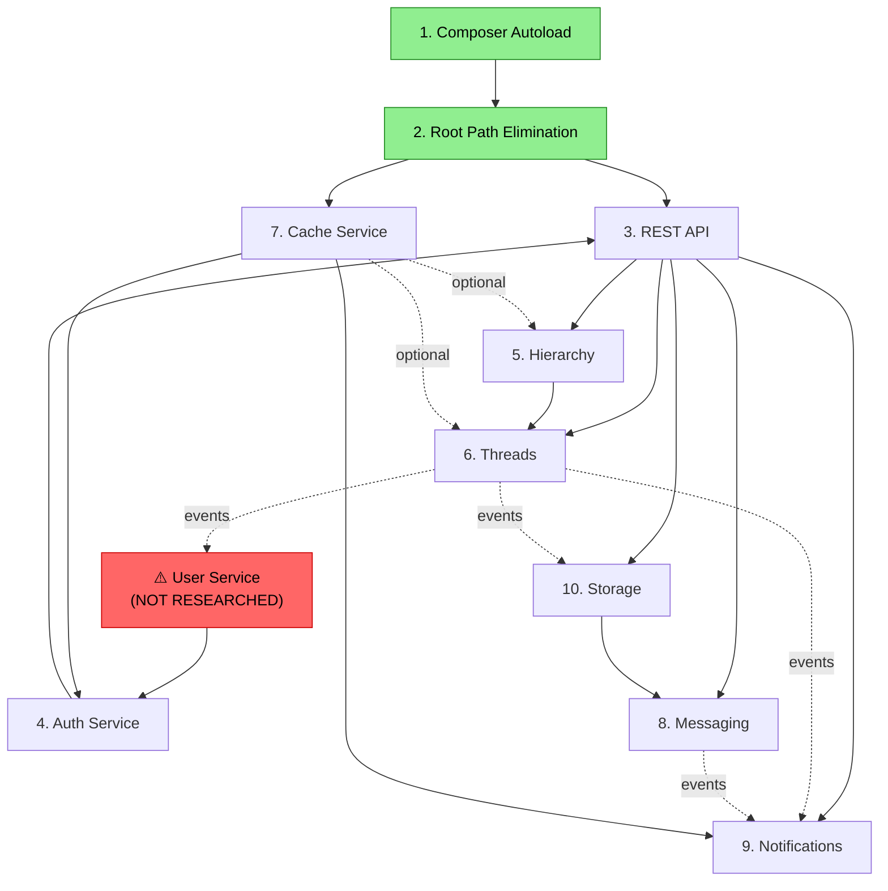

# Cross-Cutting Reality Assessment: phpBB Service Architecture

**Date**: 2026-04-19
**Scope**: All 10 research tasks under `.maister/tasks/research/`
**Status**: ✅ Critical Blockers Resolved

---

## 1. Executive Summary

This collection of researches represents a **technically sophisticated and well-reasoned** body of architectural work. Each individual service design is internally coherent, with detailed interfaces, clear ADRs, and realistic entity models. The 3 previously critical misalignments have been **resolved**: (1) **User Service** has been researched (`2026-04-19-users-service/`), (2) the **extension model** is unified as macrokernel architecture (domain core + plugins, no tagged DI), and (3) **JWT tokens** are the chosen auth mechanism (`2026-04-19-auth-unified-service/`). Two medium-priority items remain tracked as research TODOs: content storage migration (s9e XML → raw text) and forum counter update contract (Threads ↔ Hierarchy).

---

## 2. Service Inventory

| # | Service | Task ID | Outputs | Completeness | Key Decision |
|---|---------|---------|---------|--------------|--------------|
| 1 | Composer Autoload | 2026-04-15 | research-report | ✅ Complete | PSR-4 autoload for `phpbb\`, delete custom class_loader |
| 2 | Root Path Elimination | 2026-04-15 | research-report | ✅ Complete | `__DIR__`-based paths, `PHPBB_FILESYSTEM_ROOT` constant |
| 3 | REST API | 2026-04-16 | HLD + decisions + exploration | ✅ Complete | Composition over inheritance, session→token auth, YAML routes |
| 4 | Auth Service | 2026-04-18 | HLD + decisions | ✅ Complete | AuthZ only, preserve bitfield cache, route defaults for permissions |
| 5 | Hierarchy Service | 2026-04-18 | HLD + decisions + exploration | ✅ Complete | 5-service decomposition, nested set port, events+decorators |
| 6 | Threads Service | 2026-04-18 | HLD + decisions + exploration | ✅ Complete | Lean core + plugins, raw text storage, hybrid counters |
| 7 | Cache Service | 2026-04-19 | HLD + decisions + exploration | ✅ Complete | PSR-16 + TagAwareCacheInterface, filesystem-first, pool isolation |
| 8 | Messaging Service | 2026-04-19 | HLD + decisions + exploration | ✅ Complete | Thread-per-participant-set, pinned+archive, no folders |
| 9 | Notifications Service | 2026-04-19 | HLD + decisions + exploration | ✅ Complete | Full rewrite, HTTP polling 30s, React frontend, tagged DI types |
| 10 | Storage Service | 2026-04-19 | HLD + decisions + exploration | ✅ Complete | Flysystem, UUID v7, single stored_files table, hybrid serving |

All 10 tasks have complete research outputs with HLD and decision logs. Documentation quality is high across the board.

---

## 3. Alignment Matrix

### ✅ Consistent Across All Services

| Pattern | Assessment | Evidence |
|---------|-----------|----------|
| **PSR-4 Namespaces** | ✅ All use `phpbb\{service}\` | auth, hierarchy, threads, cache, messaging, notifications, storage |
| **PHP 8.2 Features** | ✅ Enums, readonly classes, match expressions | All HLDs use PHP 8.2 idioms consistently |
| **PDO for DB Access** | ✅ Direct PDO with prepared statements | Auth ADR-003, Hierarchy ADR-002, Threads, Notifications, Storage all specify PDO |
| **Symfony EventDispatcher** | ✅ All use `EventDispatcherInterface` | Every service dispatches domain events via Symfony |
| **Auth-Unaware Services** | ✅ ACL enforced externally by API layer | Hierarchy ADR-006, Threads ADR-006, Messaging trusts caller |
| **Facade + Sub-Services** | ✅ Consistent layered architecture | HierarchyService, ThreadsService, MessagingService, StorageService all follow facade pattern |
| **Value Objects & Entities** | ✅ `final readonly class` for VOs, enums for types | Consistent idiomatic PHP 8.2 modeling |
| **YAML DI Service Config** | ✅ Symfony DI container, YAML definitions | REST API, all services reference YAML config |

### ⚠️ Partially Divergent

| Pattern | Assessment | Details |
|---------|-----------|---------|
| **Cache Integration** | ⚠️ Inconsistent | Notifications explicitly uses `TagAwareCacheInterface`. Auth uses its own file cache for role cache. Hierarchy, Threads, Messaging don't specify cache integration. |
| **ID Strategy** | ⚠️ Mixed (intentional?) | Storage uses UUID v7 BINARY(16). All others use integer auto-increment or legacy IDs. Storage has good reasons (non-enumerable) but divergence should be documented as deliberate. |
| **Schema Strategy** | ⚠️ Mixed | Auth/Hierarchy/Threads/Notifications reuse legacy tables. Messaging/Storage create entirely new tables. No unified migration plan. |
| **Exception Design** | ⚠️ Per-service | Each service defines own exceptions (Auth: `AccessDeniedException`, Threads: `TopicLockedException`, Storage: `QuotaExceededException`). No shared base exception or HTTP error mapping convention. |
| **Counter Management** | ⚠️ Similar but unnormalized | Threads: "hybrid tiered" (ADR-004). Messaging: "tiered hot+cold" (ADR-7). Same approach with different names — should be unified into a shared pattern specification. |
| **Domain Events as Returns** | ⚠️ Partially adopted | Hierarchy and Threads return domain events from mutations. Messaging and Notifications use more traditional return types (result DTOs). Not consistent. |

### ✅ Resolved (previously conflicting)

| Pattern | Assessment | Details |
|---------|-----------|--------|
| **Extension/Plugin Model** | ✅ Resolved — Macrokernel | Dropped tagged DI. All services: domain core + plugins via events/decorators. **See §7.1** |
| **Authentication Token Type** | ✅ Resolved — JWT | Unified auth research chose JWT tokens. **See §7.2** |
| **User Entity Source** | ✅ Researched | User service research exists at `2026-04-19-users-service/`. **See §6.1** |

---

## 4. Dependency Graph

**Legend**: Solid arrows = hard dependency. Dashed arrows = event-based/optional.

### Dependency Analysis

**No circular dependencies detected.** ✅

**One-way dependencies verified:**
- Threads → Hierarchy (sync calls to `updateForumStats`, `updateForumLastPost`) — clean
- Threads → User (via events) — clean
- Notifications → Cache (via `TagAwareCacheInterface`) — clean
- Auth → User Entity (import) — **blocked by missing User Service**
- Storage → Hierarchy (forum_id for quotas) — weak, acceptable

**Asymmetric references (A mentions B but B doesn't mention A):**
- Auth HLD references `phpbb\user\Entity\User` and `phpbb\user\Service\AuthenticationService` — but no User Service research exists
- Hierarchy references `phpbb\notification` as subscriber consumer — Notifications doesn't reference Hierarchy back (this is fine, it's event-based)
- Threads references `phpbb\auth` for permission names (`f_post`, `f_reply`) — Auth doesn't enumerate Threads-specific permissions (this is fine)

---

## 5. Implementation Order

### Recommended Sequence

| Phase | Service(s) | Rationale | Blocked By |
|-------|-----------|-----------|------------|
| **0** | Composer Autoload + Root Path Elimination | Infrastructure prerequisites. No service code possible without these. | Nothing |
| **1** | Cache Service | Foundational utility. No upstream deps. Notifications, Auth, and future services need it. | Phase 0 |
| **2** | **User Service** ⚠️ | Auth explicitly depends on `User` entity. All services reference user_id. Must be researched and designed before Auth can be implemented. | Phase 0 |
| **3** | Auth Service | Depends on User entity and Cache (for role cache). REST API needs it for permission enforcement. | Phase 2 |
| **4** | REST API Framework | Depends on Auth for the subscriber. All service controllers need this. | Phase 3 |
| **5a** | Hierarchy Service | No service deps. Threads synchronously depends on it. | Phase 0 |
| **5b** | Storage Service | No service deps. Messaging needs it for attachments. | Phase 0 |
| **6** | Threads Service | Hard dependency on Hierarchy for counter sync. | Phase 5a |
| **7** | Messaging Service | Needs Storage for attachment plugin. | Phase 5b |
| **8** | Notifications Service | Needs all event sources (Threads, Messaging) plus Cache. Should be last. | Phase 6, 7 |

**Critical Path**: Phase 0 → Phase 1 → Phase 2 (User Service) → Phase 3 → Phase 4 → Phases 5-8

---

## 6. Critical Gaps

### 6.1 ❌ CRITICAL: User Service / User Management — NOT RESEARCHED

The Auth service HLD explicitly depends on:
- `phpbb\user\Entity\User` — imported for `AuthorizationService::isGranted(User $user, ...)`
- `phpbb\user\Service\AuthenticationService` — mentioned as owning login/logout/session
- `GroupRepository` — Auth's `PermissionResolver` needs user group membership from `phpbb\user`

The Auth ADR-001 states: *"The `phpbb\user\Service\AuthenticationService` already provides a complete 10-step login flow, session management, and auth provider integration."*

**This service does not exist in the research.** Without it:
- Auth service cannot function (no User entity to check permissions against)
- REST API's token auth cannot hydrate user data
- No login/logout flow exists
- Group membership is unresolvable

**Impact**: Blocks Phase 2 and 3 of implementation. Must be researched immediately.

### 6.2 ❌ CRITICAL: Migration Strategy — NOT DEFINED

Services make contradictory schema decisions:
- Auth/Hierarchy/Threads: reuse legacy tables exactly (zero migration)
- Messaging: entirely new schema (7 new tables, old `phpbb_privmsgs*` tables abandoned)
- Storage: new `phpbb_stored_files` replaces `phpbb_attachments`

**Unresolved questions:**
- How does legacy PM data migrate to `messaging_conversations` schema?
- How does legacy `phpbb_attachments` data migrate to `phpbb_stored_files` + UUID v7 IDs?
- What happens during the migration period — do old and new systems coexist?
- Is there a data migration tool/script plan?
- What's the cutover strategy (big bang vs gradual)?

### 6.3 ⚠️ HIGH: Search Service — NOT RESEARCHED

Threads HLD lists `SearchPlugin` as a plugin listener consuming `PostCreatedEvent` for indexing. No Search Service research exists. Search is a critical forum feature (arguably more important than messaging). phpBB's legacy search includes fulltext MySQL, fulltext Sphinx, and fulltext PostgreSQL backends.

### 6.4 ⚠️ HIGH: Session Management — NOT EXPLICITLY DESIGNED

REST API Phase 1 uses `session_begin()` + `acl()` (legacy sessions). Phase 2 switches to DB tokens. But:
- Who manages token creation/revocation? (REST API defines the table but not the management service)
- How does the admin panel authenticate? (Token? Session? Both?)
- What about CSRF protection for state-changing operations?

### 6.5 ⚠️ MEDIUM: Moderation Service (MCP)

Messaging defines reporting as a "plugin via events" (ADR-8). Threads mentions `m_edit`, `m_delete` permissions. Legacy phpBB has a full Moderator Control Panel. No moderation service is researched.

### 6.6 ⚠️ MEDIUM: BBCode / Content Formatting Plugins

Threads HLD defines `ContentPipeline` with `ContentPluginInterface` middleware chain. But no BBCode plugin, Markdown plugin, Smilies plugin, or AutoLink plugin research exists. The pipeline is designed; the plugins that actually transform content are not.

### 6.7 ⚠️ MEDIUM: Configuration Service

Services reference config values (e.g., `messaging_edit_window`, cache TTLs, quota limits) but no unified configuration service is designed. Legacy uses `$config` from `phpbb_config` table. Will the new services use the same config mechanism?

### 6.8 ⚠️ LOW: Admin Panel (ACP)

Hierarchy, Auth, and Storage all mention admin operations. No ACP service/API is researched beyond the REST API's `web/adm/api.php` entry point.

---

## 7. Contradictions & Misalignments

### 7.1 ✅ RESOLVED: Extension Model — Macrokernel Architecture

**Decision (2026-04-19)**: Tagged DI is **dropped entirely**. All services adopt a unified **macrokernel architecture**: domain service core + extending plugins.

**Previous contradiction**: Hierarchy/Threads/Messaging used events+decorators while Notifications used tagged DI for type registration. This is now resolved — **all services use the same pattern**:
- **Domain service** owns core logic
- **Plugins** extend behavior via EventDispatcher events and request/response decorators
- **No `service_collection`**, no `ordered_service_collection`, no tagged DI for type registration
- Notification types and delivery methods must be redesigned to use event-based registration (same as `RegisterForumTypesEvent` in Hierarchy)

**Impact**: Notifications HLD must be updated to replace tagged DI with plugin-based event registration. See research task `2026-04-19-plugin-system` for unified plugin architecture.

### 7.2 ✅ RESOLVED: JWT Tokens

**Decision (2026-04-19)**: **JWT tokens** are the chosen authentication mechanism. This has been addressed by a dedicated research task (`2026-04-19-auth-unified-service`).

The unified auth service research covers JWT token lifecycle (creation, validation, refresh, revocation), key management, and integration with the REST API layer. The previous REST API ADR-002 DB token design is superseded by the JWT approach from the auth unified service research.

### 7.3 ✅ RESOLVED: Symfony Kernel Rewrite

**Decision (2026-04-19)**: The Symfony kernel will be **rewritten from scratch** alongside the phpBB refactor, with an **updated Symfony version**. This eliminates the subscriber priority conflict entirely — the new kernel will define a clean request lifecycle with proper authentication → authorization ordering built in from the start.

Previous concern about priority 8 vs 16 conflicts between Auth/REST API/Notifications subscribers is moot — the new kernel will have a well-defined middleware/subscriber stack with explicit ordering.

### 7.4 🔜 DEFERRED: Content Storage Inconsistency

**Status**: Deferred to dedicated research. See `TODO-content-storage-migration.md`.

**Summary**: Threads ADR-001 specifies raw text storage, but legacy `phpbb_posts` contains s9e XML. Requires either bulk migration or dual-format ContentPipeline. Not yet resolved — needs its own research task.

### 7.5 🔜 DEFERRED: Forum Counter Update Contract

**Status**: Deferred to dedicated research. See `TODO-forum-counter-contract.md`.

**Summary**: Threads assumes `updateForumStats()` / `updateForumLastPost()` exist on Hierarchy, but Hierarchy hasn't defined them. One-way dependency assumption that needs contract alignment research.

---

## 8. Architecture Concerns

### 8.1 Big Bang vs Incremental Migration

The researches are **ambiguous** about migration strategy:

- **Greenfield signals**: Messaging designs entirely new tables. Storage designs new `stored_files` table. Cache is clean-break (ADR-007: "No bridge adapter. Legacy consumers must be rewritten."). Notifications is a "full rewrite."
- **Incremental signals**: Auth preserves legacy bitfield cache format for ACP compatibility. Hierarchy reuses `phpbb_forums` table exactly. Threads reuses `phpbb_topics`/`phpbb_posts`. REST API starts with session-based auth for existing infrastructure.

**Unresolved**: How does the legacy phpBB application coexist with new services during transition? Can a user use the old `posting.php` while new API endpoints exist? What happens when old code writes to `phpbb_posts` and new code reads it?

### 8.2 Database Access Layer

All services use PDO directly. This is consistent but means:
- No query builder abstraction (each repository writes raw SQL)
- No transaction coordination across services (Threads updates forum counters in Hierarchy — how is this transacted?)
- No shared table prefix handling (legacy `phpbb_` prefix)
- PHPStan and static analysis can't verify SQL correctness

**Recommendation**: Consider a lightweight shared DB connection wrapper that handles table prefixes and provides transaction support. Not a full ORM — just `$db->table('forums')` → `phpbb_forums` and `$db->transaction(callable)`.

### 8.3 Performance Assumptions

**Threads ADR-001** (raw text only): *"Every page view re-parses and re-renders every post (CPU cost). For a 20-post topic page, that's 20 full pipeline executions per request. A caching layer will be essential for production traffic."*

But the Cache Service design has no stampede prevention (ADR-003: "No stampede prevention. Accept duplicate computations."). For a popular topic with cold cache + 100 concurrent users, all 100 will re-parse all 20 posts simultaneously. This is a realistic concern for popular threads.

### 8.4 Frontend Strategy

**Only Notifications defines a frontend approach**: React component with `useNotifications` hook. If the entire application is being rewritten, questions remain:
- Is the whole frontend moving to React? Or is it a progressive migration with React islands?
- What renders forum threads, topic views, user profiles?
- Is there a shared state management approach (Redux, Zustand, React Query)?
- How do server-side rendered pages coexist with React components?

Notifications ADR-006 acknowledges this: *"React component can coexist with jQuery pages via `ReactDOM.createRoot()` on a mount point."* But no comprehensive frontend strategy exists.

### 8.5 Testing Strategy

No service research addresses testing strategy. Given the services are designed for testability (interfaces, DI, no globals), the obvious approach is PHPUnit with mock dependencies. But:
- No shared test infrastructure is defined (test DB setup, factory classes, mock event dispatcher)
- No integration test strategy (how to test Threads → Hierarchy counter sync?)
- No API integration test strategy (Postman collection, PHPUnit functional tests?)

---

## 9. Recommendations

### Immediate (Block Implementation)

| # | Action | Priority | Reason |
|---|--------|----------|--------|
| 1 | ~~**Research + Design User Service**~~ | ✅ Done | Researched at `2026-04-19-users-service/`. |
| 2 | ~~**Resolve Extension Model**~~ | ✅ Done | Macrokernel architecture — domain service + plugins. No tagged DI. |
| 3 | ~~**Resolve JWT vs DB Token**~~ | ✅ Done | JWT tokens. Addressed by `2026-04-19-auth-unified-service/` research. |

### Before Implementation Begins

| # | Action | Priority | Reason |
|---|--------|----------|--------|
| 4 | **Define Migration Strategy** | ⚠️ High | Document whether this is big-bang or incremental. How do old and new tables coexist? What's the PM data migration path? |
| 5 | **Define Hierarchy's Counter Update API** | 🔜 Deferred | See `TODO-forum-counter-contract.md`. |
| 6 | ~~**Fix Auth Subscriber Priorities**~~ | ✅ Done | Symfony kernel rewrite eliminates priority conflicts. |
| 7 | **Address post_text format migration** | 🔜 Deferred | See `TODO-content-storage-migration.md`. |
| 8 | **Write cross-cutting ADR for shared patterns** | ⚠️ Medium | Exception base classes, error response format, counter management pattern, transaction coordination. |

### During Implementation

| # | Action | Priority | Reason |
|---|--------|----------|--------|
| 9 | **Research Search Service** | ⚠️ Medium | Threads plugin architecture expects SearchPlugin. Must exist for basic forum functionality. |
| 10 | **Research Content Formatting Plugins** | ⚠️ Medium | ContentPipeline is designed, but BBCode/Markdown/Smilies plugins are not. |
| 11 | **Design shared DB wrapper** | ⚠️ Medium | Table prefix handling, transaction support across services. |
| 12 | **Define Frontend Strategy** | ⚠️ Medium | React islands? Full SPA? SSR? This affects how all service APIs are consumed. |
| 13 | **Design Configuration Service** | ⚠️ Low | Services reference config values but no unified config approach is documented. |
| 14 | **Research Moderation/Admin Services** | ⚠️ Low | Important for production but not blocking for core service implementation. |

---

## 10. Deployment Decision

### ✅ Ready for Implementation (with caveats)

**Verdict**: The individual service researches are **high quality** and demonstrate deep understanding of both the legacy phpBB codebase and modern PHP architecture. There is no fundamental architectural flaw — the services compose logically, the dependency graph is clean, and the technical decisions are well-reasoned.

**Previously blocking items — all 3 resolved:**

1. ~~**User Service**~~ → ✅ Researched at `2026-04-19-users-service/`
2. ~~**Extension model**~~ → ✅ Macrokernel architecture (domain core + plugins, no tagged DI)
3. ~~**Token type**~~ → ✅ JWT tokens, unified auth research at `2026-04-19-auth-unified-service/`

**Remaining open items** (non-blocking, deferred to research):
- Content storage migration (s9e XML → raw text) — see `TODO-content-storage-migration.md`
- Forum counter update contract (Threads ↔ Hierarchy) — see `TODO-forum-counter-contract.md`
- Migration strategy, shared DB wrapper, frontend strategy — addressable during implementation planning

**Bottom line**: The 3 critical blockers have been resolved. Implementation can proceed following the phased plan. Two medium-priority items are tracked as research TODOs for resolution before their respective services are implemented.
