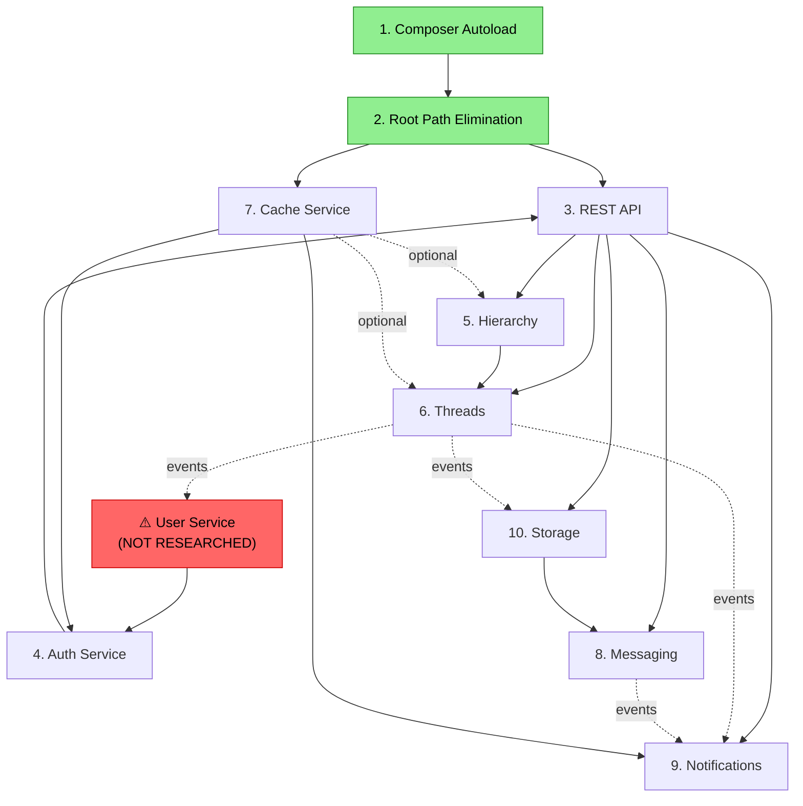

# Cross-Cutting Reality Assessment: phpBB Service Architecture

**Date**: 2026-04-19
**Scope**: All 10 research tasks under `.maister/tasks/research/`
**Status**: ⚠️ Needs Alignment

---

## 1. Executive Summary

This collection of researches represents a **technically sophisticated and well-reasoned** body of architectural work. Each individual service design is internally coherent, with detailed interfaces, clear ADRs, and realistic entity models. However, as a holistic system architecture, there are **3 critical misalignments, 2 missing foundational services, and 1 unresolved architectural contradiction** that must be addressed before implementation begins. The most pressing issues are: (1) the **User Service is entirely missing** despite being an explicit dependency of the Auth service and implicitly needed by all others, (2) the **extension model is fundamentally contradictory** between services (events+decorators vs tagged DI), and (3) **JWT vs DB token confusion** between Auth and REST API designs. The individual pieces are strong — the integration between them needs work.

---

## 2. Service Inventory

| # | Service | Task ID | Outputs | Completeness | Key Decision |
|---|---------|---------|---------|--------------|--------------|
| 1 | Composer Autoload | 2026-04-15 | research-report | ✅ Complete | PSR-4 autoload for `phpbb\`, delete custom class_loader |
| 2 | Root Path Elimination | 2026-04-15 | research-report | ✅ Complete | `__DIR__`-based paths, `PHPBB_FILESYSTEM_ROOT` constant |
| 3 | REST API | 2026-04-16 | HLD + decisions + exploration | ✅ Complete | Composition over inheritance, session→token auth, YAML routes |
| 4 | Auth Service | 2026-04-18 | HLD + decisions | ✅ Complete | AuthZ only, preserve bitfield cache, route defaults for permissions |
| 5 | Hierarchy Service | 2026-04-18 | HLD + decisions + exploration | ✅ Complete | 5-service decomposition, nested set port, events+decorators |
| 6 | Threads Service | 2026-04-18 | HLD + decisions + exploration | ✅ Complete | Lean core + plugins, raw text storage, hybrid counters |
| 7 | Cache Service | 2026-04-19 | HLD + decisions + exploration | ✅ Complete | PSR-16 + TagAwareCacheInterface, filesystem-first, pool isolation |
| 8 | Messaging Service | 2026-04-19 | HLD + decisions + exploration | ✅ Complete | Thread-per-participant-set, pinned+archive, no folders |
| 9 | Notifications Service | 2026-04-19 | HLD + decisions + exploration | ✅ Complete | Full rewrite, HTTP polling 30s, React frontend, tagged DI types |
| 10 | Storage Service | 2026-04-19 | HLD + decisions + exploration | ✅ Complete | Flysystem, UUID v7, single stored_files table, hybrid serving |

All 10 tasks have complete research outputs with HLD and decision logs. Documentation quality is high across the board.

---

## 3. Alignment Matrix

### ✅ Consistent Across All Services

| Pattern | Assessment | Evidence |
|---------|-----------|----------|
| **PSR-4 Namespaces** | ✅ All use `phpbb\{service}\` | auth, hierarchy, threads, cache, messaging, notifications, storage |
| **PHP 8.2 Features** | ✅ Enums, readonly classes, match expressions | All HLDs use PHP 8.2 idioms consistently |
| **PDO for DB Access** | ✅ Direct PDO with prepared statements | Auth ADR-003, Hierarchy ADR-002, Threads, Notifications, Storage all specify PDO |
| **Symfony EventDispatcher** | ✅ All use `EventDispatcherInterface` | Every service dispatches domain events via Symfony |
| **Auth-Unaware Services** | ✅ ACL enforced externally by API layer | Hierarchy ADR-006, Threads ADR-006, Messaging trusts caller |
| **Facade + Sub-Services** | ✅ Consistent layered architecture | HierarchyService, ThreadsService, MessagingService, StorageService all follow facade pattern |
| **Value Objects & Entities** | ✅ `final readonly class` for VOs, enums for types | Consistent idiomatic PHP 8.2 modeling |
| **YAML DI Service Config** | ✅ Symfony DI container, YAML definitions | REST API, all services reference YAML config |

### ⚠️ Partially Divergent

| Pattern | Assessment | Details |
|---------|-----------|---------|
| **Cache Integration** | ⚠️ Inconsistent | Notifications explicitly uses `TagAwareCacheInterface`. Auth uses its own file cache for role cache. Hierarchy, Threads, Messaging don't specify cache integration. |
| **ID Strategy** | ⚠️ Mixed (intentional?) | Storage uses UUID v7 BINARY(16). All others use integer auto-increment or legacy IDs. Storage has good reasons (non-enumerable) but divergence should be documented as deliberate. |
| **Schema Strategy** | ⚠️ Mixed | Auth/Hierarchy/Threads/Notifications reuse legacy tables. Messaging/Storage create entirely new tables. No unified migration plan. |
| **Exception Design** | ⚠️ Per-service | Each service defines own exceptions (Auth: `AccessDeniedException`, Threads: `TopicLockedException`, Storage: `QuotaExceededException`). No shared base exception or HTTP error mapping convention. |
| **Counter Management** | ⚠️ Similar but unnormalized | Threads: "hybrid tiered" (ADR-004). Messaging: "tiered hot+cold" (ADR-7). Same approach with different names — should be unified into a shared pattern specification. |
| **Domain Events as Returns** | ⚠️ Partially adopted | Hierarchy and Threads return domain events from mutations. Messaging and Notifications use more traditional return types (result DTOs). Not consistent. |

### ❌ Conflicting

| Pattern | Assessment | Details |
|---------|-----------|---------|
| **Extension/Plugin Model** | ❌ Contradictory | **See §7.1** |
| **Authentication Token Type** | ❌ Contradictory | **See §7.2** |
| **User Entity Source** | ❌ Missing foundation | **See §6.1** |

---

## 4. Dependency Graph

**Legend**: Solid arrows = hard dependency. Dashed arrows = event-based/optional.

### Dependency Analysis

**No circular dependencies detected.** ✅

**One-way dependencies verified:**
- Threads → Hierarchy (sync calls to `updateForumStats`, `updateForumLastPost`) — clean
- Threads → User (via events) — clean
- Notifications → Cache (via `TagAwareCacheInterface`) — clean
- Auth → User Entity (import) — **blocked by missing User Service**
- Storage → Hierarchy (forum_id for quotas) — weak, acceptable

**Asymmetric references (A mentions B but B doesn't mention A):**
- Auth HLD references `phpbb\user\Entity\User` and `phpbb\user\Service\AuthenticationService` — but no User Service research exists
- Hierarchy references `phpbb\notification` as subscriber consumer — Notifications doesn't reference Hierarchy back (this is fine, it's event-based)
- Threads references `phpbb\auth` for permission names (`f_post`, `f_reply`) — Auth doesn't enumerate Threads-specific permissions (this is fine)

---

## 5. Implementation Order

### Recommended Sequence

| Phase | Service(s) | Rationale | Blocked By |
|-------|-----------|-----------|------------|
| **0** | Composer Autoload + Root Path Elimination | Infrastructure prerequisites. No service code possible without these. | Nothing |
| **1** | Cache Service | Foundational utility. No upstream deps. Notifications, Auth, and future services need it. | Phase 0 |
| **2** | **User Service** ⚠️ | Auth explicitly depends on `User` entity. All services reference user_id. Must be researched and designed before Auth can be implemented. | Phase 0 |
| **3** | Auth Service | Depends on User entity and Cache (for role cache). REST API needs it for permission enforcement. | Phase 2 |
| **4** | REST API Framework | Depends on Auth for the subscriber. All service controllers need this. | Phase 3 |
| **5a** | Hierarchy Service | No service deps. Threads synchronously depends on it. | Phase 0 |
| **5b** | Storage Service | No service deps. Messaging needs it for attachments. | Phase 0 |
| **6** | Threads Service | Hard dependency on Hierarchy for counter sync. | Phase 5a |
| **7** | Messaging Service | Needs Storage for attachment plugin. | Phase 5b |
| **8** | Notifications Service | Needs all event sources (Threads, Messaging) plus Cache. Should be last. | Phase 6, 7 |

**Critical Path**: Phase 0 → Phase 1 → Phase 2 (User Service) → Phase 3 → Phase 4 → Phases 5-8

---

## 6. Critical Gaps

### 6.1 ❌ CRITICAL: User Service / User Management — NOT RESEARCHED

The Auth service HLD explicitly depends on:
- `phpbb\user\Entity\User` — imported for `AuthorizationService::isGranted(User $user, ...)`
- `phpbb\user\Service\AuthenticationService` — mentioned as owning login/logout/session
- `GroupRepository` — Auth's `PermissionResolver` needs user group membership from `phpbb\user`

The Auth ADR-001 states: *"The `phpbb\user\Service\AuthenticationService` already provides a complete 10-step login flow, session management, and auth provider integration."*

**This service does not exist in the research.** Without it:
- Auth service cannot function (no User entity to check permissions against)
- REST API's token auth cannot hydrate user data
- No login/logout flow exists
- Group membership is unresolvable

**Impact**: Blocks Phase 2 and 3 of implementation. Must be researched immediately.

### 6.2 ❌ CRITICAL: Migration Strategy — NOT DEFINED

Services make contradictory schema decisions:
- Auth/Hierarchy/Threads: reuse legacy tables exactly (zero migration)
- Messaging: entirely new schema (7 new tables, old `phpbb_privmsgs*` tables abandoned)
- Storage: new `phpbb_stored_files` replaces `phpbb_attachments`

**Unresolved questions:**
- How does legacy PM data migrate to `messaging_conversations` schema?
- How does legacy `phpbb_attachments` data migrate to `phpbb_stored_files` + UUID v7 IDs?
- What happens during the migration period — do old and new systems coexist?
- Is there a data migration tool/script plan?
- What's the cutover strategy (big bang vs gradual)?

### 6.3 ⚠️ HIGH: Search Service — NOT RESEARCHED

Threads HLD lists `SearchPlugin` as a plugin listener consuming `PostCreatedEvent` for indexing. No Search Service research exists. Search is a critical forum feature (arguably more important than messaging). phpBB's legacy search includes fulltext MySQL, fulltext Sphinx, and fulltext PostgreSQL backends.

### 6.4 ⚠️ HIGH: Session Management — NOT EXPLICITLY DESIGNED

REST API Phase 1 uses `session_begin()` + `acl()` (legacy sessions). Phase 2 switches to DB tokens. But:
- Who manages token creation/revocation? (REST API defines the table but not the management service)
- How does the admin panel authenticate? (Token? Session? Both?)
- What about CSRF protection for state-changing operations?

### 6.5 ⚠️ MEDIUM: Moderation Service (MCP)

Messaging defines reporting as a "plugin via events" (ADR-8). Threads mentions `m_edit`, `m_delete` permissions. Legacy phpBB has a full Moderator Control Panel. No moderation service is researched.

### 6.6 ⚠️ MEDIUM: BBCode / Content Formatting Plugins

Threads HLD defines `ContentPipeline` with `ContentPluginInterface` middleware chain. But no BBCode plugin, Markdown plugin, Smilies plugin, or AutoLink plugin research exists. The pipeline is designed; the plugins that actually transform content are not.

### 6.7 ⚠️ MEDIUM: Configuration Service

Services reference config values (e.g., `messaging_edit_window`, cache TTLs, quota limits) but no unified configuration service is designed. Legacy uses `$config` from `phpbb_config` table. Will the new services use the same config mechanism?

### 6.8 ⚠️ LOW: Admin Panel (ACP)

Hierarchy, Auth, and Storage all mention admin operations. No ACP service/API is researched beyond the REST API's `web/adm/api.php` entry point.

---

## 7. Contradictions & Misalignments

### 7.1 ❌ CRITICAL: Extension Model Contradiction

**Hierarchy ADR-004** explicitly states:
> *"The user explicitly decided to drop the legacy extension system entirely for `phpbb\hierarchy`. [...] no `service_collection`, no `ordered_service_collection`, no [`Plugin`]Interface"*

**Threads ADR-003** follows the same approach — events + request/response decorators only.

**Messaging** also uses events + decorators.

**BUT Notifications ADR-007** explicitly states:
> *"Tagged DI services with interface contracts [...] this is the established phpBB pattern for extensible collections (type tags for `notification.type`, `notification.method`). [...] follows established phpBB DI pattern"*

This is a **direct architectural contradiction**. Three services have explicitly dropped taggedDI / service_collection as an extension model, while one service adopts it as its primary extension mechanism. Either:
- All services use events+decorators (Notifications must be redesigned), OR  
- All services use tagged DI for type registration (Hierarchy/Threads must be redesigned), OR
- The distinction is intentional and documented (types-of-things via tagged DI, lifecycle-events via EventDispatcher) — but this needs to be specified in a cross-cutting architecture decision.

**Recommendation**: The tagged DI pattern for **type registration** (notification types, delivery methods) is genuinely different from the **lifecycle extension** pattern (request/response decoration). These can coexist IF intentionally documented. But `ForumTypeRegistry` in Hierarchy uses events for type registration (`RegisterForumTypesEvent`), which is the opposite of tagged DI. Pick one for type registration globally.

### 7.2 ❌ CRITICAL: JWT vs DB Token

**Auth Service HLD** System Context says:
> *"Mobile / SPA Client sends HTTP requests with Bearer JWT"*

**REST API ADR-002** and Phase 2 design specifies:
> *"DB API token — `Authorization: Bearer <token>`, new `phpbb_api_tokens` table, `token_auth_subscriber`"*
> Token verification: `hash('sha256', $incoming_token)` → SELECT from `phpbb_api_tokens`

These are fundamentally different approaches:
- **JWT**: Self-contained token, no DB lookup on every request, contains claims (user_id, expiry). Standard approach with `firebase/php-jwt` (already in vendor).
- **DB Token**: Opaque token, SHA-256 hashed, DB lookup on every request. Simpler but requires write per request (last_used).

The REST API design is explicit and detailed about DB tokens. The Auth HLD casually mentions "JWT" without any JWT infrastructure. This must be resolved — one approach must be chosen and documented.

**Recommendation**: The REST API's DB token design is more thoroughly thought through and simpler for the phpBB context (no JWT key management, no token refresh flow, immediate revocability). Align Auth HLD to use "Bearer token" instead of "Bearer JWT."

### 7.3 ⚠️ HIGH: Auth Subscriber Priority Conflict

**Auth Service ADR-005**: `AuthorizationSubscriber` at priority 8.
**REST API Phase 2**: `token_auth_subscriber` at priority 16.
**Notifications HLD**: `auth_subscriber JWT → _api_user (priority 8)`.

The REST API token auth is at 16 (authentication), Auth ACL is at 8 (authorization). This is logically correct — authenticate first, then authorize. But the Notifications HLD says "auth_subscriber JWT → _api_user (priority 8)" suggesting authentication happens at 8, which collides with ACL. 

**Resolution**: Authentication at 16 (token validation, user hydration), Authorization at 8 (ACL check). Notifications HLD must be corrected.

### 7.4 ⚠️ MEDIUM: Content Storage Inconsistency

**Threads ADR-001**: "Raw text only — single `post_text` column, full parse+render on every display."

**Messaging HLD**: `messaging_messages.message_text MEDIUMTEXT` + `metadata JSON DEFAULT NULL` — "No BBCode/formatting columns — content pipeline plugin handles rendering."

**Legacy threads**: Uses s9e XML storage with `bbcode_uid`, `bbcode_bitfield`, `enable_bbcode`, etc.

If services reuse legacy `phpbb_posts` table (which they do — Threads works with existing schema), the `post_text` column currently contains s9e XML, not raw text. The "raw text only" decision requires either:
- A one-time migration converting all s9e XML → raw text (massive, risky), OR
- A compatibility mode that the ContentPipeline handles both formats

This migration complexity is not addressed anywhere.

### 7.5 ⚠️ MEDIUM: Forum Counter Update Contract

Threads HLD says: *"Threads calls `updateForumStats()` and `updateForumLastPost()` synchronously within the same transaction."*

Hierarchy HLD does not define `updateForumStats()` or `updateForumLastPost()` as public interface methods on any service. The `HierarchyService` facade doesn't list these methods. The `ForumRepository` is described as "CRUD operations on `phpbb_forums`."

**This is a one-way dependency assumption** — Threads assumes Hierarchy exposes an API that Hierarchy hasn't defined.

---

## 8. Architecture Concerns

### 8.1 Big Bang vs Incremental Migration

The researches are **ambiguous** about migration strategy:

- **Greenfield signals**: Messaging designs entirely new tables. Storage designs new `stored_files` table. Cache is clean-break (ADR-007: "No bridge adapter. Legacy consumers must be rewritten."). Notifications is a "full rewrite."
- **Incremental signals**: Auth preserves legacy bitfield cache format for ACP compatibility. Hierarchy reuses `phpbb_forums` table exactly. Threads reuses `phpbb_topics`/`phpbb_posts`. REST API starts with session-based auth for existing infrastructure.

**Unresolved**: How does the legacy phpBB application coexist with new services during transition? Can a user use the old `posting.php` while new API endpoints exist? What happens when old code writes to `phpbb_posts` and new code reads it?

### 8.2 Database Access Layer

All services use PDO directly. This is consistent but means:
- No query builder abstraction (each repository writes raw SQL)
- No transaction coordination across services (Threads updates forum counters in Hierarchy — how is this transacted?)
- No shared table prefix handling (legacy `phpbb_` prefix)
- PHPStan and static analysis can't verify SQL correctness

**Recommendation**: Consider a lightweight shared DB connection wrapper that handles table prefixes and provides transaction support. Not a full ORM — just `$db->table('forums')` → `phpbb_forums` and `$db->transaction(callable)`.

### 8.3 Performance Assumptions

**Threads ADR-001** (raw text only): *"Every page view re-parses and re-renders every post (CPU cost). For a 20-post topic page, that's 20 full pipeline executions per request. A caching layer will be essential for production traffic."*

But the Cache Service design has no stampede prevention (ADR-003: "No stampede prevention. Accept duplicate computations."). For a popular topic with cold cache + 100 concurrent users, all 100 will re-parse all 20 posts simultaneously. This is a realistic concern for popular threads.

### 8.4 Frontend Strategy

**Only Notifications defines a frontend approach**: React component with `useNotifications` hook. If the entire application is being rewritten, questions remain:
- Is the whole frontend moving to React? Or is it a progressive migration with React islands?
- What renders forum threads, topic views, user profiles?
- Is there a shared state management approach (Redux, Zustand, React Query)?
- How do server-side rendered pages coexist with React components?

Notifications ADR-006 acknowledges this: *"React component can coexist with jQuery pages via `ReactDOM.createRoot()` on a mount point."* But no comprehensive frontend strategy exists.

### 8.5 Testing Strategy

No service research addresses testing strategy. Given the services are designed for testability (interfaces, DI, no globals), the obvious approach is PHPUnit with mock dependencies. But:
- No shared test infrastructure is defined (test DB setup, factory classes, mock event dispatcher)
- No integration test strategy (how to test Threads → Hierarchy counter sync?)
- No API integration test strategy (Postman collection, PHPUnit functional tests?)

---

## 9. Recommendations

### Immediate (Block Implementation)

| # | Action | Priority | Reason |
|---|--------|----------|--------|
| 1 | **Research + Design User Service** | ❌ Critical | Auth depends on User entity, all services need user_id. Blocks implementation Phase 2+. |
| 2 | **Resolve Extension Model** | ❌ Critical | Write an ADR: tagged DI for type-registries, events+decorators for lifecycle extension. Apply consistently. Align Notifications to use the same ForumType-style event registration OR document why tagged DI is acceptable for notification types. |
| 3 | **Resolve JWT vs DB Token** | ❌ Critical | Pick one. Update Auth HLD to say "Bearer token" not "Bearer JWT." Confirm DB token approach from REST API ADR-002. |

### Before Implementation Begins

| # | Action | Priority | Reason |
|---|--------|----------|--------|
| 4 | **Define Migration Strategy** | ⚠️ High | Document whether this is big-bang or incremental. How do old and new tables coexist? What's the PM data migration path? |
| 5 | **Define Hierarchy's Counter Update API** | ⚠️ High | Threads assumes `updateForumStats()` exists. Hierarchy must expose it. |
| 6 | **Fix Auth Subscriber Priorities** | ⚠️ High | Document: Auth (token validation) priority 16, ACL (authorization) priority 8. Fix Notifications HLD. |
| 7 | **Address post_text format migration** | ⚠️ High | If reusing legacy `phpbb_posts`, existing data is s9e XML, not raw text. ContentPipeline must handle both, or data must be migrated. |
| 8 | **Write cross-cutting ADR for shared patterns** | ⚠️ Medium | Exception base classes, error response format, counter management pattern, transaction coordination. |

### During Implementation

| # | Action | Priority | Reason |
|---|--------|----------|--------|
| 9 | **Research Search Service** | ⚠️ Medium | Threads plugin architecture expects SearchPlugin. Must exist for basic forum functionality. |
| 10 | **Research Content Formatting Plugins** | ⚠️ Medium | ContentPipeline is designed, but BBCode/Markdown/Smilies plugins are not. |
| 11 | **Design shared DB wrapper** | ⚠️ Medium | Table prefix handling, transaction support across services. |
| 12 | **Define Frontend Strategy** | ⚠️ Medium | React islands? Full SPA? SSR? This affects how all service APIs are consumed. |
| 13 | **Design Configuration Service** | ⚠️ Low | Services reference config values but no unified config approach is documented. |
| 14 | **Research Moderation/Admin Services** | ⚠️ Low | Important for production but not blocking for core service implementation. |

---

## 10. Deployment Decision

### ⚠️ Needs Alignment

**Verdict**: The individual service researches are **high quality** and demonstrate deep understanding of both the legacy phpBB codebase and modern PHP architecture. There is no fundamental architectural flaw — the services compose logically, the dependency graph is clean, and the technical decisions are well-reasoned.

However, **implementation cannot begin** on the full service stack until:

1. **User Service** is researched and designed (blocks Auth, which blocks everything)
2. **Extension model contradiction** is resolved (affects how all services handle plugins)
3. **Token type** is aligned between Auth and REST API

After resolving these 3 critical items, the remaining issues (migration strategy, counter API, subscriber priorities) can be addressed during implementation planning.

**Bottom line**: The parts are well-made. The assembly instructions are missing. Fix the 3 critical items, write a thin cross-cutting architecture document that standardizes the shared patterns, and this becomes a solid foundation for implementation.
